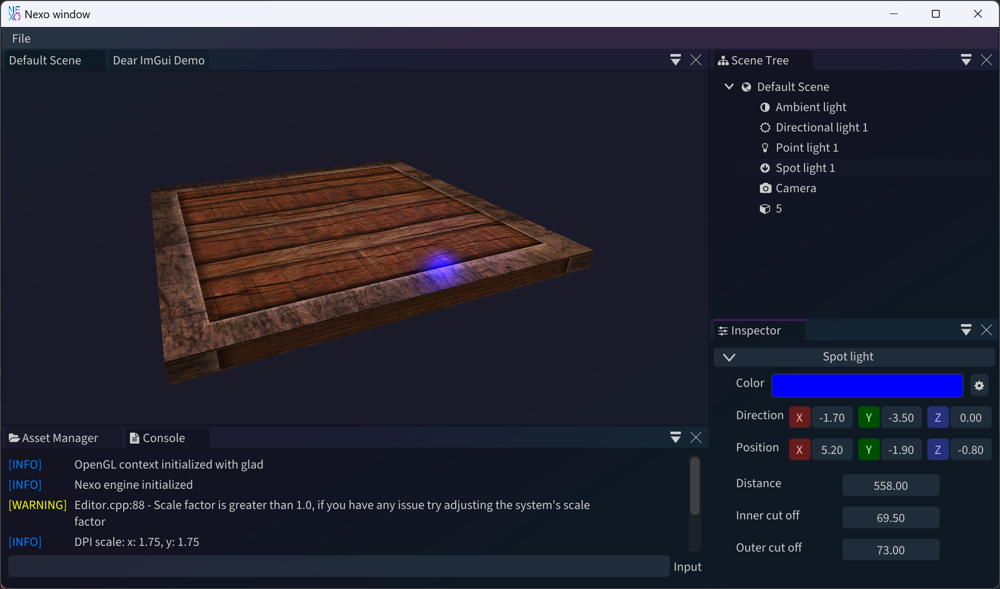

# NEXO Engine

Welcome to the NEXO Engine repository! This project is a collaborative effort to create a revolutionnary game engine. Our goal is to provide a robust, user-friendly, and efficient platform for game development in desktop as well as in virtual reality!

[](https://github.com/NexoEngine/game-engine/actions/workflows/build.yml) 
[](https://sonarcloud.io/summary/new_code?id=NexoEngine_game-engine) 
[](https://sonarcloud.io/summary/new_code?id=NexoEngine_game-engine) 
[](https://sonarcloud.io/summary/new_code?id=NexoEngine_game-engine) 
[](https://sonarcloud.io/summary/new_code?id=NexoEngine_game-engine)

## Table of Contents

- [NEXO Engine](#nexo-engine)
  - [Table of Contents](#table-of-contents)
  - [Project Overview](#project-overview)
    - [Game Engine](#game-engine)
  - [External Dependencies](#external-dependencies)
  - [Build the project](#build-the-project)
  - [Install the project](#install-the-project)
    - [Install via CMake](#install-via-cmake)
    - [Create an installer for Windows (NSIS)](#create-an-installer-for-windows-nsis)
    - [Create an installer for Linux (DEB)](#create-an-installer-for-linux-deb)
  - [Run the tests](#run-the-tests)
  - [The Team](#the-team)

> [!NOTE]  
> Find the whole documentation on our [website](https://nexoengine.github.io/game-engine/).

## Project Overview

### Game Engine

Interface screenshot



Quick video of the game engine in action

https://github.com/Thyodas/rtype/assets/53176398/425d7935-3e52-4b3d-b9bd-701120994e2d

> [!WARNING]
> This project is still in development and is not yet ready for production use. Some features may change.

## External Dependencies

To run this project, ensure you have the following:
- **CMake**: Necessary for building the project from source.
- **C++ Compiler**: We recommend using GCC or Clang for Linux and MacOS, and MSVC for Windows.

## Build the project

Cloning and building is a breeze:
1. Clone the repository with the submodules.
```bash
git clone --recurse-submodules
```

2. Run cmake to generate the build files.

<details>
  <summary>Using cmake presets (automatic)</summary>
  ```bash
  cmake --workflow --present=build-debug
  ```

  > [!NOTE]
  > There are several presets available: `build-debug`, `build-release`, `build-coverage`, `minimal-build`, `test-debug`, and `test-coverage`.
</details>

<details>
  <summary>Using cmake --build (manual)</summary>
  ```bash
  cmake -B build
  cmake --build build
  ```
</details>

3. Launch the engine!

For Linux and MacOS:
```bash
./build/nexoEditor
```

For Windows:
```bash
./build/nexoEditor.exe
```

> [!NOTE]
> For detailed instructions, visit our [Installation Guide](docs/install/README.md).

## Install the project

### Install via CMake

First build the project as seen in the step [Build the project](#build-the-project).
Then run the following command:

```bash
cmake --install build --prefix /path/to/install
```

This will install the NEXO Engine in the directory `/path/to/install` with all the necessary files.

### Create an installer for Windows (NSIS)

To create an installer for Windows, you can use the [NSIS](https://nsis.sourceforge.io/Main_Page) installer.

> [!WARNING]
> We assume here that you already ran the cmake command to generate the build files in the `build` directory.

First install NSIS on your computer, then run the following command:

```bash
cd build
cpack -G NSIS -C Debug
```

Now you can run the generated installer to install the NEXO Engine on your computer.

## Create an installer for Linux (DEB)

> [!WARNING]
> We assume here that you already ran the cmake command to generate the build files in the `build` directory.

```bash
cd build
cpack -G DEB
```

To install the generated package (on Ubuntu/Debian...), run the following command:

```bash
sudo dpkg -i NEXO-Engine-*-Linux.deb
```

## Run the tests

In this project tests use the [gtest](http://google.github.io/googletest/) library.

First build the tests:
```bash
cmake -B build -DNEXO_BUILD_TESTS=ON
cmake --build build
```

Then run the tests:
```bash
cd build
ctest -C Debug
```

## Troubleshooting

If you encounter any issues, please refer to our [Troubleshooting Guide](docs/troubleshooting/troubleshooting.md).

## The Team

NEXO Engine is brought to life by a dedicated team of fourth-year students from EPITECH Strasbourg:
- Guillaume HEIN (@Thyodas)
- Jean CARDONNE (@jcardonne)
- Marie GIACOMEL (@Sauterelle57)
- Mehdy MORVAN (@iMeaNz)
- Thomas PARENTEAU (@ThomasParenteau)

## Acknowledgements

This project is part of our curriculum and end of studies project, showcasing our collective skills in advanced software development with modern C++.

We thank Epitech for the opportunity to work on such an engaging project and for the support throughout our educational journey.
